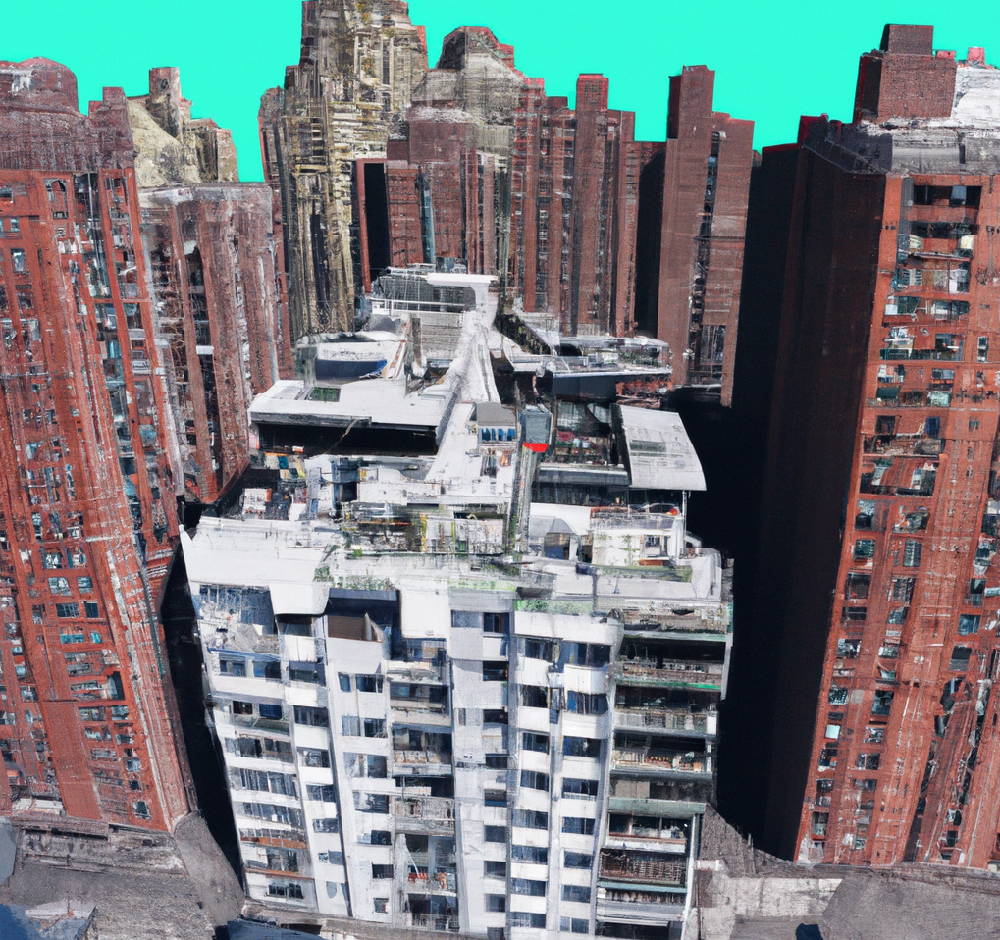

<!--  -->

<iframe src="https://slides.com/pharringtonp19/housing-homelessness-lecture-three/embed" width="576" height="420" title="Copy of Housing & Homelessness Lecture Three" scrolling="no" frameborder="0" webkitallowfullscreen mozallowfullscreen allowfullscreen></iframe>

<li>
<a href="https://academic.oup.com/qje/article/133/3/1107/4850660">The Effects of Neighborhoods on Intergenerational Mobility I: Childhood Exposure Effects</a>
</li>

<li>
<a href="https://www.aeaweb.org/articles?id=10.1257/aer.20150572">The Effects of Exposure to Better Neighborhoods on Children: New Evidence from the Moving to Opportunity Experiment</a>
</li>

<li>
<a href="https://robcollinson.github.io/RobWebsite/CCS_Gautreaux.pdf">The Long-Run Effects of Residential Racial Desegregation Programs: Evidence from Gautreaux</a>
</li>

<li>
<a href="https://www.aeaweb.org/articles?id=10.1257/aer.20161352">Moved to Opportunity: The Long-Run Effects of Public Housing Demolitions on
Children</a>
</li>

