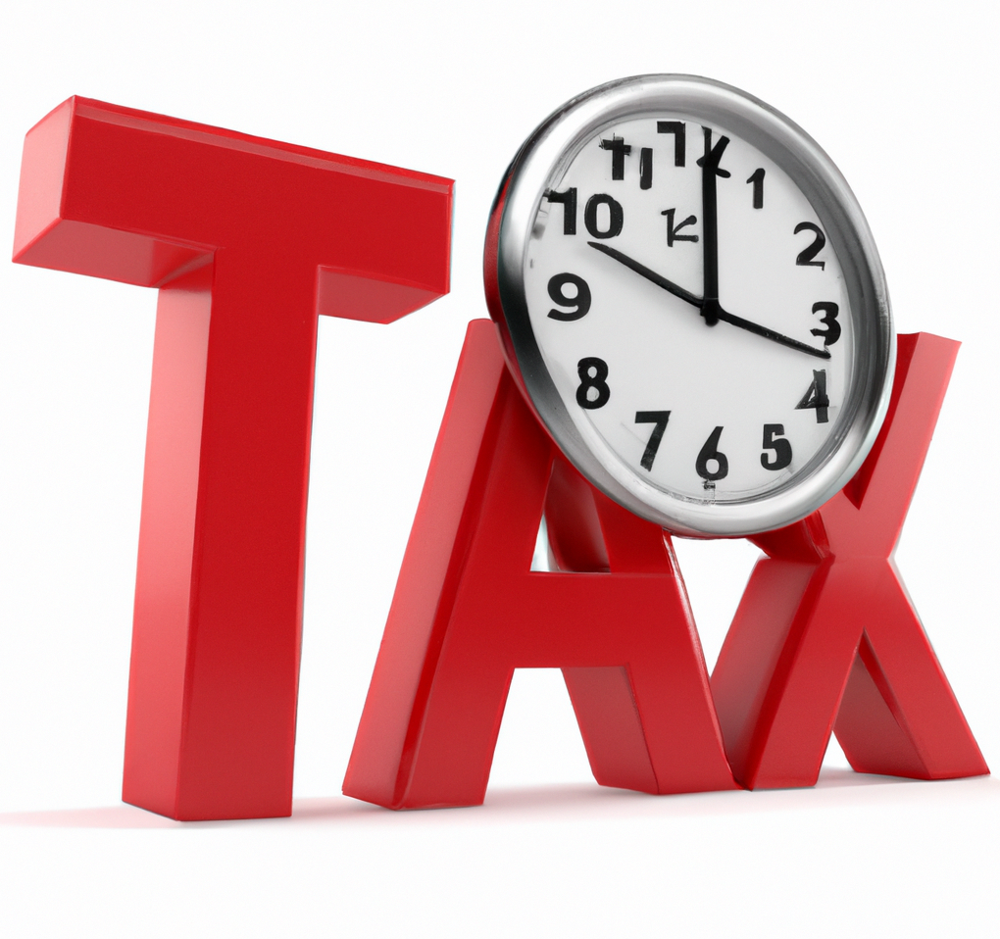

<h1> Articles </h1>
<a href="https://www.theatlantic.com/politics/archive/2021/07/how-government-learned-waste-your-time-tax/619568/" target="_blank">
  <button>The Atlantic THE TIME TAX
Why is so much American bureaucracy left to average citizens?</button>
</a>

